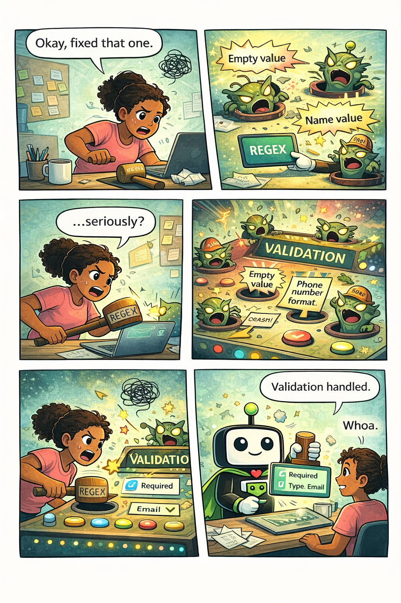

## The Pain Is Real

You fix one validation bug and two more pop up. The phone number format works for US numbers but breaks for international. The email regex rejects valid addresses. Max length validation conflicts with the paste handler. Welcome to validation whack-a-mole—the game nobody wins.

<!-- truncate -->

## Why This Happens

Form validation seems straightforward until you actually try to implement it. Consider email validation: the "official" regex for RFC 5322 compliant email addresses is over 6,000 characters long. Most developers use simplified versions that reject perfectly valid addresses (did you know `user+tag@domain.co.uk` is valid?).

Phone numbers are worse. International formats vary wildly: `+1 (555) 123-4567`, `555.123.4567`, `+44 20 7946 0958`. Date formats differ by locale. Postal codes have different rules per country.

The real cost of validation bugs isn't just developer time—it's lost users. Studies show that form abandonment increases dramatically when users encounter unexpected validation errors. Every false rejection is a potential customer walking away.

## The NetPad Approach

NetPad takes a declarative approach to validation. Instead of writing regex patterns, you check boxes:

- **Required** - Field must have a value
- **Email** - Validates against real-world email patterns
- **Phone** - Handles international formats automatically
- **URL** - Accepts valid web addresses
- **Number range** - Min/max with proper error messages
- **Pattern** - Custom regex when you actually need it

NetPad offers 30+ field types, each with appropriate built-in validation. A phone field knows how to validate phone numbers. A date field handles date logic. You focus on what data you need, not how to validate it.

When you do need custom validation, NetPad supports custom rules with clear error messages—but you'll find you need them far less often than you'd expect.

## Try It Yourself

Stop playing whack-a-mole with validation bugs. [Explore NetPad's field types](/docs/forms/field-types) and see how built-in validation saves hours of regex debugging.

---

*This post is part of our weekly DevLife comic series. [Subscribe to the blog](/blog) to get new comics every Monday.*
