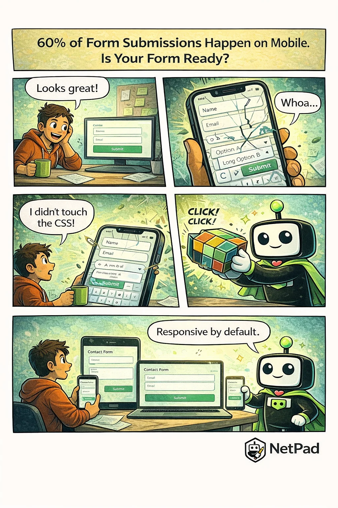

## The Pain Is Real

You built the form, tested it on your desktop, shipped it to production. Then the support tickets start rolling in: "I can't tap the submit button," "the dropdown is cut off," "I can't see what I'm typing." You open the form on your phone and watch in horror as fields overlap, buttons disappear, and your carefully designed layout crumbles.

<!-- truncate -->

## Why This Happens

Mobile form design is harder than it looks. Desktop forms have generous space—fields can sit side by side, labels can be long, buttons can be anywhere. On mobile, everything changes:

- **Touch targets** need to be at least 44x44 pixels
- **Labels** must be visible when the keyboard opens
- **Dropdowns** often need custom implementations
- **Multi-column layouts** collapse unpredictably
- **Viewport height** changes when keyboards appear

Most developers test on one or two devices and call it done. But the mobile landscape is fragmented—different screen sizes, different browsers, different keyboard behaviors. What works on an iPhone 15 might break on a Samsung Galaxy, and both might fail on a tablet.

The business impact is significant. Mobile form abandonment rates are substantially higher than desktop. If your form is frustrating on mobile, you're losing conversions.

## The NetPad Approach

Every NetPad form is mobile-first by design. You don't add responsive behavior—it's built in:

- **Automatic layout adaptation** - Multi-column desktop layouts stack properly on mobile
- **Touch-optimized fields** - Appropriately sized tap targets and spacing
- **Keyboard-aware design** - Forms scroll to keep active fields visible
- **Cross-device preview** - See exactly how your form renders on phone, tablet, and desktop

NetPad handles the CSS media queries, the viewport calculations, and the touch event handling. You focus on what fields you need, and the platform ensures they work everywhere.

## Try It Yourself

See how your forms could look on every device. [Preview NetPad's responsive forms](/docs/forms/form-builder) and stop losing mobile users to bad UX.

---

*This post is part of our weekly DevLife comic series. [Subscribe to the blog](/blog) to get new comics every Monday.*
