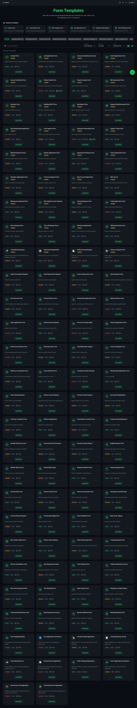

# 5 Minutes to a Working React Form with NetPad

What if you could skip all the form boilerplate and just... have a working React form?

Pick a template. Tweak it visually. Export the code. Done.

Let me show you how.

<!-- truncate -->

## The Old Way (Pain)

Building a React form from scratch means:
- Setting up form state (useState or a library)
- Writing validation logic
- Handling error messages
- Making it accessible
- Making it responsive
- Connecting to your backend

Even a "simple" contact form takes hours to do right.

## The New Way (5 Minutes)

### Step 1: Pick a Template

Head to [netpad.io](https://netpad.io) and sign up (free tier available).

Once you're in, click **New Form** and browse the **Template Gallery**:



We've got 100+ templates across categories:
- **Customer Service** — Feedback, support tickets, surveys
- **HR & Recruitment** — Job applications, onboarding
- **Healthcare** — Patient intake, appointments
- **Events** — Registration, RSVPs
- **Finance** — Expense reports, invoices

For this demo, let's grab the **Contact Form** template.

### Step 2: Customize (Drag & Drop)

The Form Builder opens with your template loaded. Now make it yours:

**Add a field:**
- Drag "Phone" from the sidebar
- Drop it after "Email"

**Edit a field:**
- Click any field to open settings
- Change label, placeholder, validation rules

**Reorder fields:**
- Drag and drop to rearrange

**Add conditional logic:**
- "Show Company field only if Account Type = Business"

No code. Just point and click.

### Step 3: Preview & Test

Click **Preview** to see exactly what your users will see:
- Fill out the form
- See validation in action
- Test on mobile view

Everything works before you write a single line of code.

### Step 4: Get Your Code

Here's the magic. Click **Code** in the toolbar and choose your framework:

**React:**
```tsx
// Generated code — ready to paste into your project
import { useForm } from 'react-hook-form';
import { zodResolver } from '@hookform/resolvers/zod';
import { z } from 'zod';

const schema = z.object({
  name: z.string().min(1, 'Name is required'),
  email: z.string().email('Invalid email'),
  phone: z.string().optional(),
  message: z.string().min(10, 'Message must be at least 10 characters'),
});

export function ContactForm() {
  const { register, handleSubmit, formState: { errors } } = useForm({
    resolver: zodResolver(schema),
  });

  return (
    <form onSubmit={handleSubmit(onSubmit)}>
      {/* ... full form JSX generated */}
    </form>
  );
}
```

**Also available:**
- Vue.js
- Angular  
- Next.js
- Svelte
- Plain HTML/JS
- Python (Flask, FastAPI, Django)
- Node.js (Express)
- And more...

Click **Copy** or **Download** and paste into your project.

## Alternative: Use @netpad/forms Package

Don't want to generate code? Use the form directly:

```bash
npm install @netpad/forms @mui/material @emotion/react @emotion/styled
```

```tsx
import { FormRenderer } from '@netpad/forms';

function App() {
  // Fetch your form config from NetPad API
  const config = await fetch('https://netpad.io/api/v1/forms/my-form')
    .then(r => r.json());

  return (
    <FormRenderer 
      config={config.data}
      onSubmit={(data) => console.log(data)}
    />
  );
}
```

Your form stays in sync with NetPad—update the form visually, your app gets the changes automatically.

## Using the CLI

Prefer the command line? Install the NetPad CLI:

```bash
npm install -g @netpad/cli
netpad login
```

**Search templates:**
```bash
netpad search "contact form"
```

**Install a template package:**
```bash
netpad install @netpad/contact-form-template
```

**List what you have:**
```bash
netpad list
```

## What You Get

Whichever path you choose, you get:

✅ **Production-ready code** — Not a rough draft, actual working code  
✅ **Built-in validation** — Email format, required fields, custom rules  
✅ **Accessibility** — ARIA labels, keyboard navigation  
✅ **Responsive design** — Works on mobile out of the box  
✅ **Type safety** — TypeScript types included  

## Real Example: Employee Onboarding

Let's do something more complex. From the Template Gallery, pick **Employee Onboarding**.

This template includes:
- **Multi-step wizard** (4 pages)
- **Conditional fields** (office location shows only if not remote)
- **Nested data** (emergency contact as sub-object)
- **Multiple field types** (text, date, dropdown, radio, checkbox)

Customize it:
1. Change the departments to match your company
2. Add your office locations
3. Remove fields you don't need
4. Add any custom fields

Click **Code** → **React** → **Download**.

You just built a multi-step onboarding wizard in 5 minutes.

## Submissions Go to MongoDB

When users submit your form, the data goes straight to MongoDB:

```json
{
  "_id": "507f1f77bcf86cd799439011",
  "firstName": "Jane",
  "lastName": "Doe",
  "email": "jane@example.com",
  "department": "engineering",
  "startDate": "2026-02-15",
  "remoteWork": true,
  "emergencyContact": {
    "name": "John Doe",
    "relationship": "spouse",
    "phone": "+1-555-0123"
  },
  "submittedAt": "2026-01-31T15:30:00Z"
}
```

View, filter, and export submissions from the NetPad dashboard—or query directly with the API.

## Summary

| Step | Time |
|------|------|
| Pick template | 30 seconds |
| Customize fields | 2-3 minutes |
| Preview & test | 1 minute |
| Export code | 10 seconds |
| **Total** | **~5 minutes** |

No more form boilerplate. No more validation headaches. No more accessibility fixes.

Just working forms.

## Get Started

1. **Sign up** at [netpad.io](https://netpad.io) (free tier)
2. **Browse templates** in the gallery
3. **Export code** or use the `@netpad/forms` package

Questions? Join our [Discord](https://discord.gg/netpad) or check the [docs](https://docs.netpad.io).

---

*Stop building forms from scratch. Start shipping.*
