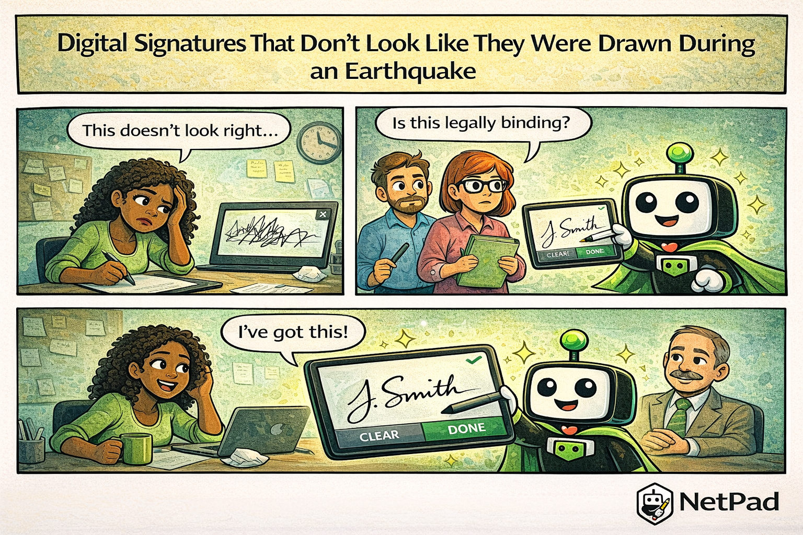

## The Pain Is Real

The customer signs on the dotted line—or rather, they try to. The resulting "signature" looks like a seismograph reading during an earthquake. Jagged lines, random loops, and something that vaguely resembles their initials if you squint. "Is this legally binding?" your compliance team asks, looking at what appears to be a child's scribble.

<!-- truncate -->

## Why This Happens

Capturing signatures digitally is harder than it seems. The naive approach—tracking mouse or touch coordinates and drawing lines between them—creates choppy, unnatural signatures. Real signatures have:

- **Smooth curves** - Not point-to-point straight lines
- **Pressure variation** - Thicker strokes when pressing harder
- **Speed awareness** - Faster strokes should be thinner
- **Natural flow** - The pen doesn't teleport between points

Most signature implementations ignore these nuances. They capture coordinates at fixed intervals, draw straight lines between them, and produce signatures that look nothing like pen on paper.

Legal requirements add complexity. Many jurisdictions require signatures to be captured in specific formats, with timestamps, and sometimes with additional metadata about the signing device. A basic canvas drawing won't cut it for regulated industries.

## The NetPad Approach

NetPad's signature field produces signatures that actually look like signatures:

- **Smooth rendering** - Bezier curves instead of point-to-point lines
- **Pressure sensitivity** - When supported by the device
- **Touch optimized** - Works equally well with finger, stylus, or mouse
- **Multiple formats** - Export as PNG, SVG, or raw coordinate data
- **Timestamp capture** - Records when the signature was made
- **Clear/redo** - Let users try again if they're not happy

For compliance requirements, NetPad captures the metadata needed for legal validity: timestamp, device information, and the signature data in formats that can be verified later.

## Try It Yourself

Capture signatures that hold up legally and look professional. [Add signature fields to your forms](/docs/forms/field-types) with NetPad's built-in signature capture.

---

*This post is part of our weekly DevLife comic series. [Subscribe to the blog](/blog) to get new comics every Monday.*
