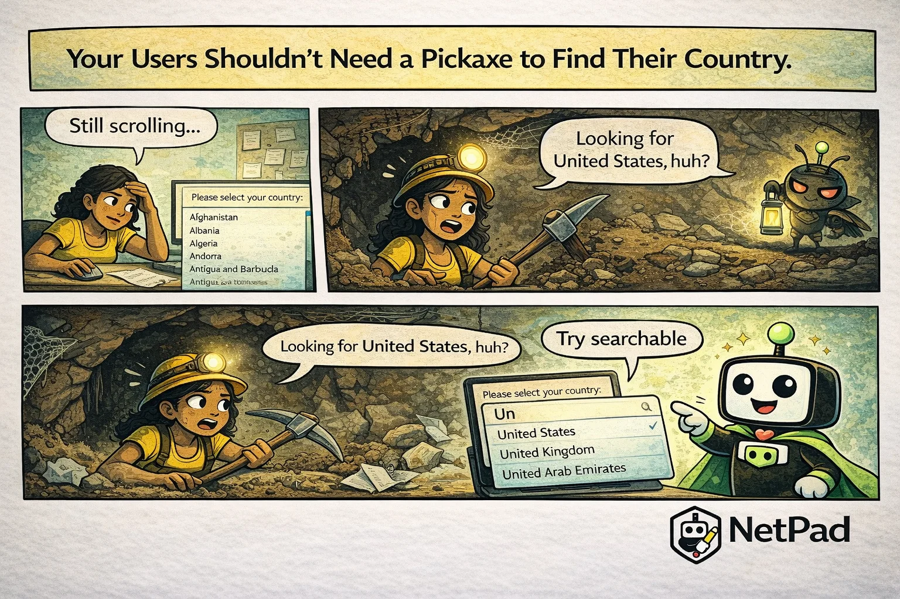

## The Pain Is Real

"Please select your country." The user clicks the dropdown and starts scrolling. And scrolling. Past Afghanistan, Albania, Algeria... They're looking for United States, which is alphabetically near the bottom of nearly 200 options. By the time they find it, they've lost the will to complete your form.

<!-- truncate -->

## Why This Happens

The standard HTML `<select>` element was designed for short lists. It works fine for "Yes/No" or a handful of options. But as lists grow, usability plummets:

- **200 countries** means serious scrolling
- **Thousands of cities** is practically unusable
- **Product catalogs** become impossible to navigate
- **Users typo frequently** when they can't search

Developers know this is a problem, but the solution—a searchable, filterable dropdown—is surprisingly complex to build well. Keyboard navigation, accessibility, mobile compatibility, and performance with large datasets all need consideration.

Most teams either live with the bad UX or implement a half-solution that works on desktop but breaks on mobile. Neither option serves users well.

## The NetPad Approach

NetPad's searchable select fields transform long lists into usable interfaces:

- **Type to filter** - Start typing and options narrow instantly
- **Keyboard navigation** - Arrow keys, enter to select, escape to close
- **Mobile optimized** - Native-feeling interface on touch devices
- **Lazy loading** - Handles thousands of options without performance issues
- **Grouped options** - Organize options into categories when helpful
- **Recent selections** - Optionally show previously selected values first

A country selector becomes pleasant: type "Un" and see United States, United Kingdom, United Arab Emirates. Three keystrokes instead of thirty seconds of scrolling.

## Try It Yourself

Make your long lists usable. [Explore NetPad's select field options](/docs/forms/field-types) and stop torturing users with endless scrolling.

---

*This post is part of our weekly DevLife comic series. [Subscribe to the blog](/blog) to get new comics every Monday.*
