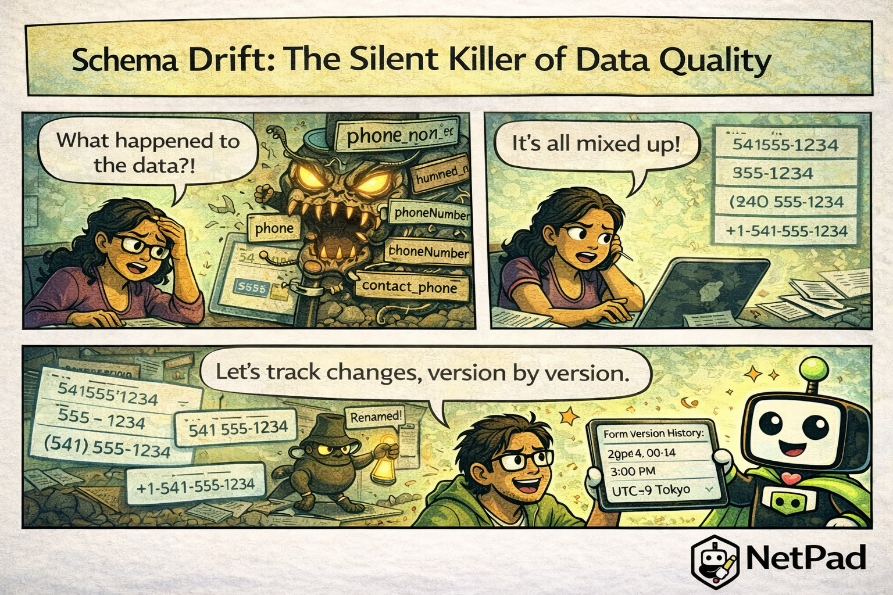

## The Pain Is Real

"Last week this field was 'phone'. Now some records have 'phone', some have 'phone_number', some have 'phoneNumber', and three records have 'contact_phone'." Your data analyst stares at the dashboard, trying to figure out how the same form produced four different field names—and which one contains the correct data.

<!-- truncate -->

## Why This Happens

Forms evolve. Someone renames a field for clarity. Someone else adds a new field. A developer copies the form and makes tweaks. Over time, you end up with:

- **Inconsistent field names** across records
- **Changed data types** (text becomes number, or vice versa)
- **Missing fields** in old records
- **Extra fields** in new records
- **No record** of when changes happened or why

This is schema drift, and it's particularly painful with document databases like MongoDB where the flexibility that makes development fast can also let inconsistencies creep in unnoticed.

The cost shows up later: reports break, aggregations fail, migrations become nightmares, and nobody trusts the data anymore. Teams spend hours manually reconciling records that should have been consistent all along.

## The NetPad Approach

NetPad tracks form versions automatically:

- **Version history** - Every form change creates a new version
- **Change tracking** - See what changed between versions
- **Schema documentation** - Each version's schema is recorded
- **Backward compatibility** - Old submissions remain valid
- **Migration tools** - Update old records when needed

When you query data, you know exactly what schema produced each record. When you need to run reports across schema versions, NetPad's data browser handles the mapping. And when you need to migrate old data to a new schema, you can do it with confidence.

## Try It Yourself

Keep your data consistent as your forms evolve. [Learn about NetPad's schema management](/docs/forms/form-builder) and stop schema drift before it corrupts your data.

---

*This post is part of our weekly DevLife comic series. [Subscribe to the blog](/blog) to get new comics every Monday.*
