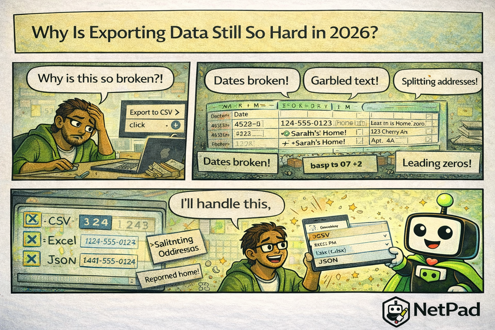

## The Pain Is Real

You click "Export to CSV" and open the file in Excel. The dates have become numbers. The phone numbers lost their leading zeros. The special characters are garbled. The addresses that contained commas are now split across three columns. Your spreadsheet is crying, and honestly, so are you.

<!-- truncate -->

## Why This Happens

CSV seems simple—it's just comma-separated values. But the simplicity hides a world of pain:

- **Encoding issues** - UTF-8, UTF-16, Windows-1252? Excel guesses wrong
- **Date formats** - Excel converts dates to its internal number format
- **Number formatting** - Leading zeros disappear, large numbers become scientific notation
- **Delimiter confusion** - What if your data contains commas?
- **Newlines in fields** - Multi-line text breaks row parsing
- **Nested data** - How do you CSV an array?

Every export implementation makes different choices, and Excel makes its own assumptions when opening the file. The result is a game of telephone where data gets corrupted at every step.

The business cost is real: teams spend hours cleaning up exports, reformatting data, and manually fixing corrupted values. Reports are delayed, decisions are made on bad data, and everyone learns to distrust the "Export" button.

## The NetPad Approach

NetPad's export tools produce files that actually work:

- **Proper encoding** - UTF-8 with BOM for Excel compatibility
- **Date preservation** - Dates export in ISO format that Excel reads correctly
- **Number handling** - Option to preserve leading zeros as text
- **Escape handling** - Commas, quotes, and newlines properly escaped
- **Excel native** - Export directly to .xlsx when CSV isn't enough
- **JSON export** - For nested data and programmatic use

You choose the format that fits your needs. CSV for simple data, Excel for formatted reports, JSON for integration with other systems. Each format is generated correctly, not just "probably okay."

## Try It Yourself

Export data that opens correctly the first time. [Learn about NetPad's export options](/docs/data-explorer/browsing-data) and stop fighting with corrupted spreadsheets.

---

*This post is part of our weekly DevLife comic series. [Subscribe to the blog](/blog) to get new comics every Monday.*
