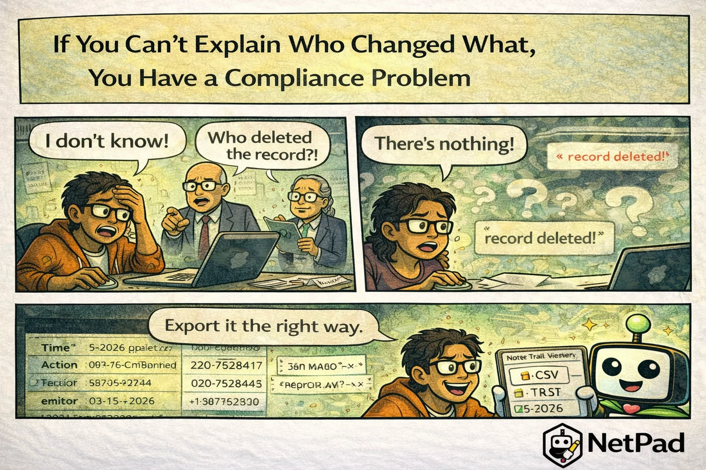

## The Pain Is Real

"Who deleted the customer record?" Your boss is asking, compliance is asking, and your log file just says "record deleted" with no timestamp, no user ID, and no indication of what the record contained. You're sweating because you genuinely don't know—and neither does anyone else.

<!-- truncate -->

## Why This Happens

Audit logging is one of those features that's easy to skip during development. The application works without it. Users don't see it. It seems like overhead—until the day you need it.

Compliance frameworks require detailed audit trails:

- **GDPR** - Right to know what data was collected and changed
- **HIPAA** - Access logs for protected health information
- **SOX** - Financial system change tracking
- **SOC 2** - Evidence of access controls

But compliance aside, audit trails are crucial for debugging, security incident response, and simply understanding what happened in your system. Without them, you're flying blind.

Building comprehensive audit logging is substantial work: intercepting every data change, capturing context (who, when, from where), storing logs securely, making them searchable. Most teams implement partial solutions that miss crucial events.

## The NetPad Approach

NetPad logs everything automatically:

- **Every submission** - Who submitted, when, from where
- **Every edit** - Previous and new values, who made the change
- **Every deletion** - What was deleted and by whom
- **Every access** - Who viewed which records
- **Every configuration change** - Form modifications, permission changes

Logs are searchable, filterable, and exportable. When the auditor asks "who accessed customer X's data in the last 90 days," you can answer in seconds. When someone claims they didn't delete that record, you can prove otherwise.

## Try It Yourself

Stop dreading audit questions. [Learn about NetPad's audit logging](/docs/security/overview) and have answers ready before anyone asks.

---

*This post is part of our weekly DevLife comic series. [Subscribe to the blog](/blog) to get new comics every Monday.*
