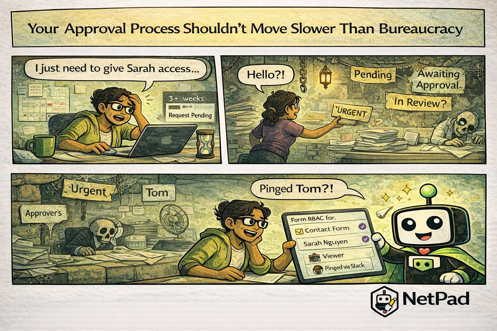

## The Pain Is Real

A request was submitted three weeks ago. It's been "pending approval" ever since. The approver went on vacation, forgot about it, or never saw the email notification. Meanwhile, the requester is stuck waiting, the business process is blocked, and everyone's frustrated by a workflow that moves slower than actual government bureaucracy.

<!-- truncate -->

## Why This Happens

Manual approval processes have predictable failure modes:

- **Email gets buried** - Approval requests lost in inbox noise
- **No accountability** - Unclear who's responsible for approving
- **No escalation** - Requests sit forever if the approver is unavailable
- **No visibility** - Requesters can't see where their request is stuck
- **No reminders** - Out of sight, out of mind

The irony is that companies implement approval workflows for control and accountability, but poor implementation creates the opposite: delays, workarounds, and frustrated employees who find ways to bypass the system entirely.

The business cost is significant. Purchase orders delayed for weeks. Expense reports waiting months. New hire approvals blocking onboarding. Every stalled approval represents wasted time and opportunity cost.

## The NetPad Approach

NetPad's approval workflows keep things moving:

- **Clear assignment** - Each step has a defined approver (or group)
- **Automatic notifications** - In-app, email, or both
- **Escalation rules** - Auto-escalate after configurable time
- **Delegation** - Approvers can delegate when unavailable
- **Visibility** - Requesters see exactly where their request is
- **Parallel approvals** - When multiple approvers can act simultaneously
- **Audit trail** - Who approved what, when, with comments

Build your approval logic visually: first manager approves, then finance reviews if over $1000, then auto-escalate to director if no response in 48 hours. The workflow engine handles the routing, notifications, and tracking.

## Try It Yourself

Escape approval purgatory. [Build approval workflows with NetPad](/docs/api/workflows) and keep your processes moving at business speed.

---

*This post is part of our weekly DevLife comic series. [Subscribe to the blog](/blog) to get new comics every Monday.*
