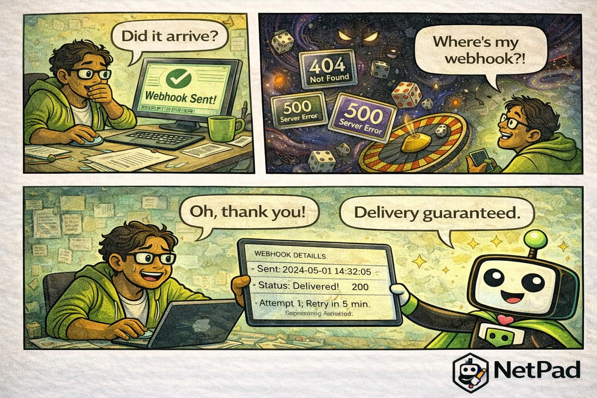

## The Pain Is Real

Did the webhook fire? Did it arrive? The form was submitted—you can see that in the database. But the downstream system has no record of receiving anything. You check the logs (if there are logs) and find nothing useful. "Webhook sent successfully" on your end, but apparently it vanished into the void between your server and theirs.

<!-- truncate -->

## Why This Happens

Webhooks are HTTP calls, and HTTP is unreliable across the internet:

- **Network issues** - Temporary connectivity problems
- **Timeouts** - The receiving server was slow to respond
- **Server errors** - 500s happen, especially under load
- **Bad endpoints** - URL changed and nobody updated the webhook
- **Duplicates** - Retry sent the same event twice

Most webhook implementations are fire-and-forget. They make the HTTP call and move on. If it fails, there's no retry. If it succeeds but the receiving server crashes before processing, the event is lost. If you want delivery confirmation, you're building it yourself.

The result is "webhook roulette"—sometimes events arrive, sometimes they don't, and you're never quite sure which outcome you'll get.

## The NetPad Approach

NetPad's webhook node treats delivery as a first-class concern:

- **Automatic retries** - Configurable retry with exponential backoff
- **Delivery tracking** - See every webhook attempt with status
- **Failure alerts** - Know immediately when webhooks are failing
- **Payload logging** - Review what was sent for debugging
- **Idempotency keys** - Prevent duplicate processing on retries
- **Timeout handling** - Configurable timeouts with retry on timeout

When a webhook fires, you can trace its journey: sent at 14:32:05, received 200 response in 340ms. When it fails, you see exactly what happened and when the next retry will occur.

## Try It Yourself

Build integrations you can trust. [Configure webhooks in NetPad workflows](/docs/api/workflows) and stop wondering whether your events actually arrived.

---

*This post is part of our weekly DevLife comic series. [Subscribe to the blog](/blog) to get new comics every Monday.*
