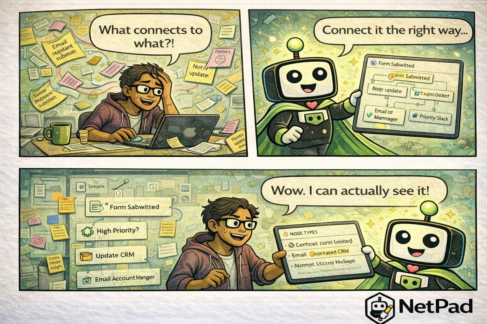

## The Pain Is Real

Your desk is covered in sticky notes: "Email when form submitted." "Update CRM." "Notify Slack." "Add to spreadsheet if priority = high." They're connected by mental string that only you understand. Then the wind blows (metaphorically—a new requirement comes in), and suddenly you're untangling which integration talks to which system and in what order.

<!-- truncate -->

## Why This Happens

Integrations start small. "Just send an email when someone submits the form." Easy—a few lines of code or a quick Zapier connection. Then you need to update the CRM too. And notify Slack. And log to a spreadsheet. And webhook to the billing system. And...

Each integration is added independently:
- Different tools for different connections
- No unified view of what happens when
- Documentation in someone's head (or sticky notes)
- Testing requires triggering real events
- Debugging means checking five different systems

The glue code holding everything together becomes its own maintenance burden. When something breaks, you're hunting through multiple platforms trying to find where the chain failed.

## The NetPad Approach

NetPad's Visual Workflow Builder lets you see all your integrations in one place:

- **25+ node types** - Email, Slack, webhooks, database, AI, and more
- **Visual canvas** - Drag, drop, connect
- **Unified testing** - Test workflows without real events
- **Execution history** - See exactly what ran and when
- **Error handling** - Built-in retry, fallback, and notification

Your sticky note diagram becomes an actual diagram—one that executes. "On form submit → filter high priority → update CRM → email account manager → notify Slack" is visible, testable, and maintainable.

## Try It Yourself

Consolidate your integration chaos. [Build workflows visually with NetPad](/docs/api/workflows) and throw away the sticky notes.

---

*This post is part of our weekly DevLife comic series. [Subscribe to the blog](/blog) to get new comics every Monday.*
