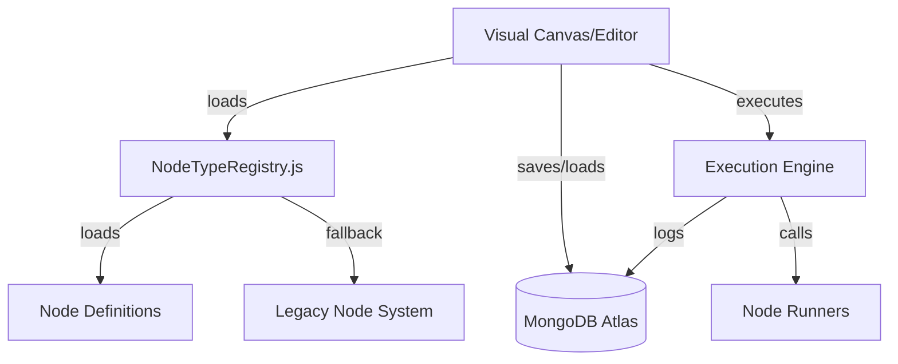

# NetPad Architecture Overview

NetPad is a collaborative, agentic workflow builder and SVG diagram editor, designed for extensibility, performance, and modern developer experience.

---

## System Overview

**NetPad** enables developers and domain experts to create, run, and share agentic workflows visually, with robust backend support for real-time collaboration, persistence, and extensibility.

### Core Layers

- **Frontend:** Next.js (App Router), React 18+, Material UI 5+
- **Backend:** Node.js API routes, MongoDB Atlas for persistence
- **Node System:** Modular, browser/server-safe, lazy-loaded node definitions
- **Execution Engine:** Graph traversal, node runners, context/state propagation
- **Plugin & Migration Layer:** Legacy system fallback for older nodes, plugin support planned

---

## Directory Structure

```
src/app/node-system/
├── core/
│   ├── NodeTypeRegistry.js      # Single source of node types, browser/server safety
│   ├── NodeTypeLoader.js        # Loads node definitions (DB + fallback)
│   ├── NodeTypeSchema.js        # Unified Zod validation for node parameters
│   └── NodeTypeContext.js       # React context for node types
├── definitions/                 # Each modern node type in a single file
│   ├── AgentNode.js
│   ├── ChatNode.js
│   ├── CodeNode.js
│   ├── MemoryNode.js
│   └── (others...)
├── components/
│   ├── NodeRenderer.js          # Universal renderer for nodes
│   ├── PropertyRenderer.js      # Generic property editor for nodes
│   └── custom/                  # For rare custom components
├── runners/                     # Node execution functions (string-referenced)
├── utils/
│   └── migration.js             # Migration & legacy support utilities
└── index.js                     # Barrel exports
```

---

## Key Components

### 1. Node System (Modular)

- All node logic (type, label, ports, properties, validation, runner, etc.) is in one file per node.
- Nodes are browser/server safe by default—no server dependencies in browser bundles.
- Gradual migration: old node types use the legacy system, new ones use modular.

### 2. Execution Engine

- Loads node definitions dynamically
- Each node has a `runner` (referenced by string), which is invoked during workflow execution
- Supports context propagation, error handling, tracing

### 3. Persistence

- Diagrams and workflows are stored in MongoDB Atlas in canonical JSON format
- All data is validated using Zod schemas

### 4. Collaboration

- Real-time editing powered by websockets (planned)
- User sessions and RBAC (role-based access control) with NextAuth.js

---

## Typical Workflow

1. **Editor loads node types from NodeTypeRegistry**
2. **User creates or edits diagram using visual canvas**
3. **Node definitions provide metadata, ports, properties, validation, runner, and factory**
4. **When executed, engine calls the runner for each node, passing inputs/outputs/context**
5. **Diagrams and execution logs are persisted in MongoDB Atlas**

---

## Modern Node Example (Key Elements)

```js
// src/app/node-system/definitions/AgentNode.js
export default {
  type: 'agent_node',
  label: 'Agent Node',
  appearance: { icon: 'Person', color: '#2196f3' },
  ports: {
    input: [{ id: 'input1', label: 'Input', type: 'any' }],
    output: [{ id: 'output1', label: 'Success', type: 'any' }]
  },
  properties: [
    {
      section: 'Agent',
      fields: [
        { name: 'systemPrompt', type: 'multiline', label: 'System Prompt', default: 'You are a helpful AI assistant.' }
      ]
    }
  ],
  runtime: { runner: 'agentNodeRunner', timeout: 30000, async: true },
  create: (params = {}) => ({
    id: params.id || `agent_${Date.now()}`,
    type: 'agent_node',
    label: params.label || 'Agent Node',
    params: { ...params.params }
  })
};
```

---

## Development Standards

- Always reference runners by string key (never direct import in node definition)
- Use Zod for validation in node definitions
- Add new nodes via the modular system first (legacy fallback is automatic)
- Keep all node properties serializable and browser-safe

---

## See Also

- [Modular Node System: How to Add/Update Nodes](./modular-node-system.md)
- [Data Model](./data-model.md)
- [Extending NetPad](./extending-netpad.md)

---

## Architecture Diagram



---

**For troubleshooting or extending NetPad, always start with the modular node system and this architecture guide.**
