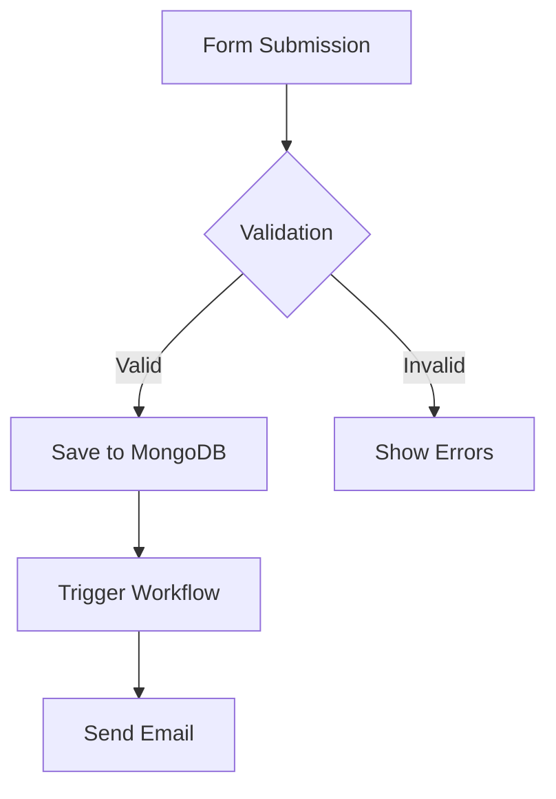

# Adding Images to Documentation

This guide explains how to add images and screenshots to NetPad documentation.

## Image Locations

### Site-Wide Images

Place images in `/static/img/` for site-wide use:
```
static/
  img/
    docs/              # Documentation-specific images
      forms/           # Form-related screenshots
      workflows/        # Workflow screenshots
      data-explorer/   # Data explorer screenshots
      platform/        # Platform screenshots
    logo.png           # Site logos
    favicon.ico        # Favicon
```

### Page-Specific Images

You can also place images next to markdown files:
```
docs/
  forms/
    building-forms.md
    images/
      form-builder.png
      field-palette.png
```

## Adding Images to Markdown

### Basic Image Syntax

```markdown

```

### With Title/Caption

```markdown

```

### Using HTML for More Control

```html

```

### Centered Images

```html
<div style={{textAlign: 'center'}}>
  
  <p><em>Form Builder Interface</em></p>
</div>
```

## Image Best Practices

### File Naming

- Use descriptive names: `form-builder-interface.png`
- Use kebab-case: `field-types-overview.png`
- Include context: `workflow-editor-canvas.png`

### Image Formats

- **PNG**: For screenshots, diagrams with text
- **JPG/JPEG**: For photos (rarely needed)
- **SVG**: For icons, simple diagrams
- **GIF**: For animated demonstrations (use sparingly)

### Image Sizes

- **Screenshots**: 1200-1600px width (retina-ready)
- **Diagrams**: 800-1200px width
- **Icons**: 64-128px
- **Optimize**: Compress images before adding

### Alt Text

Always include descriptive alt text:
- ✅ Good: `![Form Builder with field palette open]`
- ❌ Bad: `![image]` or `![screenshot]`

## Organizing Images

### By Feature

Organize images by feature area:
```
static/img/docs/
  forms/
    form-builder.png
    field-types.png
    validation-rules.png
  workflows/
    workflow-editor.png
    node-types.png
    execution-monitor.png
  data-explorer/
    collection-browser.png
    document-viewer.png
```

### By Document

Group images with their documents:
```
docs/
  forms/
    building-forms.md
    building-forms/
      images/
        step1-connect-mongodb.png
        step2-add-fields.png
        step3-publish.png
```

## Examples

### Screenshot with Caption

```markdown
<div style={{textAlign: 'center'}}>
  
  <p><em>The Form Builder interface with field palette and canvas</em></p>
</div>
```

### Inline Image

```markdown
When you click the "Add Field" button, you'll see the field palette:


Select a field type to add it to your form.
```

### Side-by-Side Comparison

```html
<div style={{display: 'flex', gap: '20px', margin: '20px 0'}}>
  <div style={{flex: 1}}>
    
    <p><em>Table View</em></p>
  </div>
  <div style={{flex: 1}}>
    
    <p><em>Card View</em></p>
  </div>
</div>
```

### Annotated Screenshot

For complex screenshots, consider:
1. Adding numbered annotations in the image
2. Using a tool like [Annotely](https://annotely.com/) or [Markup](https://getmarkup.com/)
3. Creating a labeled version

```markdown


1. Field Palette - Drag fields from here
2. Form Canvas - Drop fields here
3. Properties Panel - Configure selected field
4. Preview Button - Test your form
```

## Tools for Creating Screenshots

### Screenshot Tools

- **macOS**: Cmd+Shift+4 (select area), Cmd+Shift+3 (full screen)
- **Windows**: Snipping Tool, Windows+Shift+S
- **Linux**: Flameshot, Shutter
- **Cross-platform**: ShareX, Lightshot

### Image Editing

- **Crop/Resize**: Preview (macOS), GIMP, ImageMagick
- **Annotate**: Annotely, Markup, Skitch
- **Optimize**: ImageOptim, TinyPNG, Squoosh

### Creating Diagrams

- **Mermaid**: Built into Docusaurus (see below)
- **Draw.io**: Free diagram tool
- **Excalidraw**: Hand-drawn style diagrams
- **Figma**: Professional design tool

## Using Mermaid Diagrams

Docusaurus supports Mermaid diagrams natively:

````markdown

````

## Image Optimization

### Before Adding

1. **Resize**: Resize to appropriate dimensions
2. **Compress**: Use tools like ImageOptim or TinyPNG
3. **Format**: Use PNG for screenshots, SVG for diagrams
4. **Test**: Verify image looks good at different sizes

### Compression Tools

- **ImageOptim** (macOS): Drag and drop
- **TinyPNG**: Web-based, preserves transparency
- **Squoosh**: Google's compression tool
- **ImageMagick**: Command-line tool

```bash
# Example: Resize and optimize with ImageMagick
convert screenshot.png -resize 1200x -quality 85 optimized.png
```

## Accessibility

### Alt Text Guidelines

- **Descriptive**: Describe what's in the image
- **Contextual**: Include relevant context
- **Concise**: Keep it brief but informative
- **Avoid**: "Image of", "Screenshot of" (redundant)

Examples:
- ✅ `![Form builder with three fields: name, email, and message]`
- ✅ `![Workflow canvas showing form trigger connected to email node]`
- ❌ `![Screenshot]`
- ❌ `![Image]`

### Decorative Images

For decorative images, use empty alt text:
```markdown

```

## Version Control

### Git LFS (Large File Storage)

For large images, consider Git LFS:
```bash
git lfs install
git lfs track "*.png"
git lfs track "*.jpg"
```

### Image Sizes

- **Small images** (< 100KB): Commit directly
- **Large images** (> 100KB): Consider Git LFS or external hosting

## Common Use Cases

### Step-by-Step Tutorials

```markdown
## Step 1: Create Form


## Step 2: Add Fields


```

### Feature Demonstrations

```markdown
### Conditional Logic

NetPad supports powerful conditional logic:


Configure rules to show or hide fields based on user responses.
```

### UI Component Documentation

```markdown
### Field Properties Panel

The properties panel appears when you select a field:


Configure field name, validation rules, and conditional logic.
```

## Quick Reference

### Markdown Syntax
```markdown

```

### HTML Syntax
```html

```

### Paths
- **Absolute** (from site root): `/img/docs/forms/form-builder.png`
- **Relative** (from markdown file): `./images/form-builder.png` (if in same directory)

## Next Steps

1. Take screenshots of key features
2. Organize them in `/static/img/docs/`
3. Add images to relevant documentation pages
4. Optimize images for web
5. Add descriptive alt text
