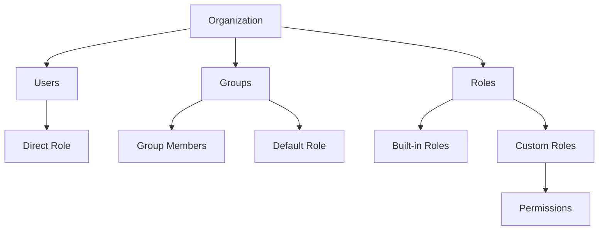

# Role-Based Access Control (RBAC)

NetPad provides a comprehensive RBAC system for managing organization access. Control who can do what with users, groups, roles, and granular permissions.

## Overview

The RBAC system consists of:

- **Users**: Organization members with roles
- **Groups**: Teams of users for easier permission management
- **Roles**: Built-in and custom roles with permissions
- **Permissions**: 40+ granular permission strings
- **Assignments**: Flexible role assignment to users and groups



## Managing Users

### Built-in Organization Roles

| Role | Description | Key Capabilities |
|------|-------------|------------------|
| **Owner** | Full control | Delete org, manage billing, all permissions |
| **Admin** | Management | Manage members, settings, resources |
| **Member** | Standard access | Create forms/workflows, edit own resources |
| **Viewer** | Read-only | View resources, no editing |

### User Management via Web UI

Navigate to **Organization Settings → Members**:

1. **View Members**: See all org members with roles and activity
2. **Invite Member**: Click "Invite Member", enter email and role
3. **Change Role**: Click member menu → "Change Role"
4. **Remove Member**: Click member menu → "Remove Member"

### User Management via CLI

```bash
# List all members
netpad users list -o <orgId>

# Invite a new user
netpad users add jane@example.com --role member -o <orgId>

# Show user details
netpad users info jane@example.com -o <orgId>

# Change user role
netpad users update jane@example.com --role admin -o <orgId>

# Remove user
netpad users remove jane@example.com -o <orgId>
```

### User Management via Terminal

In the NetPad web terminal:

```bash
users list                          # List members
users add jane@example.com          # Invite user
users info jane@example.com         # Show user details
users update jane@example.com --role admin  # Change role
users remove jane@example.com       # Remove user
```

## Groups

Groups (teams) allow you to organize users and assign permissions collectively.

### Creating Groups

**Web UI**: Organization Settings → Groups → Create Group

**CLI/Terminal**:
```bash
netpad groups create "Engineering" --role member -o <orgId>
```

### Group Features

- **Default Role**: All group members inherit this role
- **Member Management**: Add/remove users from groups
- **Bulk Permissions**: Assign roles to entire groups

### Group Commands

```bash
# List groups
netpad groups list -o <orgId>

# Create group with default role
netpad groups create "Engineering" --role member --description "Engineering team"

# View group details
netpad groups info engineering -o <orgId>

# Add member to group
netpad groups add-member engineering jane@example.com

# Remove member from group
netpad groups remove-member engineering jane@example.com

# Delete group
netpad groups delete engineering -o <orgId>
```

## Custom Roles

Beyond built-in roles, create custom roles with specific permissions.

### Creating Custom Roles

**Web UI**: Organization Settings → Roles → Create Role

**CLI/Terminal**:
```bash
# Create a custom role
netpad roles create "Billing Admin" --base viewer --description "Can manage billing"

# Add permissions to role
netpad roles grant billing-admin org:manage_billing
netpad roles grant billing-admin org:read
```

### Role Inheritance

Custom roles can inherit from built-in roles:

```bash
# Create role that inherits from 'viewer' and adds specific permissions
netpad roles create "Form Reviewer" --base viewer
netpad roles grant form-reviewer responses:read
netpad roles grant form-reviewer responses:export
```

### Role Commands

```bash
# List all roles
netpad roles list -o <orgId>

# Show role permissions
netpad roles info billing-admin -o <orgId>

# Grant permission
netpad roles grant <roleId> <permission>

# Revoke permission
netpad roles revoke <roleId> <permission>

# Delete custom role
netpad roles delete billing-admin -o <orgId>
```

## Permissions

### Permission Categories

| Category | Permissions |
|----------|-------------|
| **org** | `org:read`, `org:update`, `org:delete`, `org:manage_billing`, `org:manage_settings` |
| **members** | `members:read`, `members:invite`, `members:remove`, `members:update_role` |
| **groups** | `groups:read`, `groups:create`, `groups:update`, `groups:delete`, `groups:manage_members` |
| **roles** | `roles:read`, `roles:create`, `roles:update`, `roles:delete`, `roles:assign` |
| **projects** | `projects:read`, `projects:create`, `projects:update`, `projects:delete` |
| **forms** | `forms:read`, `forms:create`, `forms:update`, `forms:delete`, `forms:publish`, `forms:manage_permissions` |
| **responses** | `responses:read`, `responses:export`, `responses:delete` |
| **connections** | `connections:read`, `connections:create`, `connections:update`, `connections:delete`, `connections:use`, `connections:view_credentials` |
| **workflows** | `workflows:read`, `workflows:create`, `workflows:update`, `workflows:delete`, `workflows:execute` |
| **integrations** | `integrations:read`, `integrations:create`, `integrations:update`, `integrations:delete` |
| **audit** | `audit:read` |

### Permission Commands

```bash
# List all available permissions
netpad permissions list

# Check if you have a permission
netpad permissions check forms:create -o <orgId>

# View your effective permissions
netpad permissions me -o <orgId>
```

## Role Assignments

Assign roles to users or groups with optional scoping.

### Assigning Roles

```bash
# Assign role to user
netpad assign user jane@example.com editor -o <orgId>

# Assign role to group
netpad assign group engineering admin -o <orgId>

# Assign scoped role (project-level)
netpad assign user bob@example.com viewer --scope project:proj_123 -o <orgId>

# Assign time-limited role
netpad assign user temp@example.com member --expires 2025-03-01 -o <orgId>
```

### Removing Assignments

```bash
# Remove role from user
netpad unassign user jane@example.com editor -o <orgId>

# Remove role from group
netpad unassign group engineering admin -o <orgId>
```

## Effective Permissions

A user's effective permissions come from multiple sources:

1. **Direct Role**: Their organization membership role
2. **Group Membership**: Roles from groups they belong to
3. **Role Assignments**: Explicit role assignments
4. **Scoped Permissions**: Project or form-specific permissions

### Viewing Effective Permissions

**CLI**:
```bash
netpad whoami --effective -o <orgId>
```

**Terminal**:
```bash
whoami --effective
```

**API**:
```bash
GET /api/platform/users/me/permissions?orgId=<orgId>
```

## Best Practices

### 1. Use Groups for Teams
Instead of assigning roles to individual users, create groups:
- "Engineering" with member role
- "Admins" with admin role
- "Contractors" with viewer role

### 2. Principle of Least Privilege
Start with viewer role, add permissions as needed:
```bash
# Create restricted role
netpad roles create "Data Entry" --base viewer
netpad roles grant data-entry forms:read
netpad roles grant data-entry responses:read
netpad roles grant data-entry responses:export
```

### 3. Use Custom Roles for Specific Needs
Common custom roles:
- **Billing Admin**: `org:read`, `org:manage_billing`
- **Form Reviewer**: `forms:read`, `responses:read`, `responses:export`
- **Content Editor**: `forms:read`, `forms:update`, `forms:publish`

### 4. Regular Permission Audits
Periodically review:
- Who has admin/owner access
- Group memberships
- Custom role permissions
- Expired assignments

### 5. Document Your RBAC Strategy
Maintain documentation of:
- Custom roles and their purpose
- Group structure
- Permission rationale

## API Reference

### Members
- `GET /api/platform/orgs/{orgId}/members` - List members
- `GET /api/platform/orgs/{orgId}/members/{id}` - Get member
- `PATCH /api/platform/orgs/{orgId}/members/{id}` - Update role
- `DELETE /api/platform/orgs/{orgId}/members/{id}` - Remove member

### Groups
- `GET /api/platform/orgs/{orgId}/groups` - List groups
- `POST /api/platform/orgs/{orgId}/groups` - Create group
- `GET /api/platform/orgs/{orgId}/groups/{id}` - Get group
- `PATCH /api/platform/orgs/{orgId}/groups/{id}` - Update group
- `DELETE /api/platform/orgs/{orgId}/groups/{id}` - Delete group

### Roles
- `GET /api/platform/orgs/{orgId}/roles` - List roles
- `POST /api/platform/orgs/{orgId}/roles` - Create role
- `GET /api/platform/orgs/{orgId}/roles/{id}` - Get role
- `PATCH /api/platform/orgs/{orgId}/roles/{id}` - Update role
- `DELETE /api/platform/orgs/{orgId}/roles/{id}` - Delete role

### Assignments
- `GET /api/platform/orgs/{orgId}/assignments` - List assignments
- `POST /api/platform/orgs/{orgId}/assignments` - Create assignment
- `DELETE /api/platform/orgs/{orgId}/assignments?assignmentId={id}` - Remove assignment

### User Permissions
- `GET /api/platform/users/me/permissions?orgId={orgId}` - Get effective permissions
